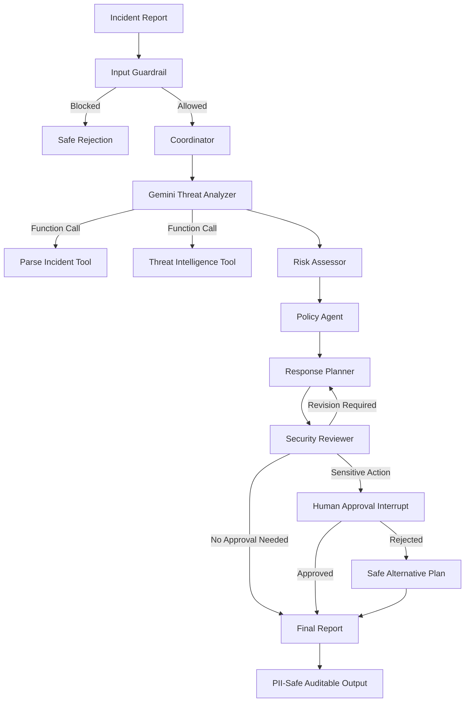

<div align="center">

# 🛡️ AI SOC Commander

### Secure LLM-Powered Multi-Agent Cybersecurity Incident Response System

**Capstone Project — Advanced Agentic AI Systems Engineering**


</div>

## Project Information

| Item | Details |
|---|---|
| Program | Advanced Agentic AI Systems Engineering |
| Delivery | SDAIA Academy via Learning Space |
| Cohort / Session | August 2026 |
| Duration | 5 days — 30 training hours |
| Trainer | Eng. Mohammed Albeladi |
| Project | AI SOC Commander |
| LLM | Google Gemini with real function calling |
| Orchestration | LangGraph StateGraph |
| Deployment | FastAPI, Docker, Docker Compose |
| Persistence | SQLite checkpointer |

## Table of Contents

- [Overview](#overview)
- [Problem and Scope](#problem-and-scope)
- [Key Features](#key-features)
- [Architecture](#architecture)
- [Real LLM Function Calling](#real-llm-function-calling)
- [Agents and Tools](#agents-and-tools)
- [Security and Guardrails](#security-and-guardrails)
- [Persistence, HITL, and Production](#persistence-hitl-and-production)
- [Observability and Evidence](#observability-and-evidence)
- [Run in Google Colab](#run-in-google-colab)
- [Local Setup](#local-setup)
- [API Usage](#api-usage)
- [Repository Structure](#repository-structure)
- [Rubric Mapping](#rubric-mapping)
- [Team](#team)
- [Acknowledgment](#acknowledgment)

## Overview

AI SOC Commander is an enterprise-style Agentic AI system for defensive cybersecurity incident response. It receives a natural-language incident report, blocks malicious prompt injection, masks PII, delegates analysis to specialized agents, uses a real Gemini LLM to choose and call analysis tools, scores risk, retrieves relevant policy, plans a safe response, reviews the plan, pauses for human approval before sensitive actions, and produces an auditable final report.

## Problem and Scope

Security teams must combine evidence, threat intelligence, internal policy, and human approval under time pressure. This project demonstrates how a controlled agent graph can support that workflow without executing destructive real-world actions. The system analyzes simulated incidents and recommends bounded, reversible defensive actions.

## Key Features

- Real Gemini LLM inference at a decision point
- Real function calling with model-selected tools
- Plan-and-Execute reasoning pattern
- Reviewer self-critique and bounded revision loop
- LangGraph StateGraph with shared typed state
- Nine role-specialized agents
- Prompt-injection blocking and PII masking
- Structured JSONL logs and metrics
- SQLite persistence across graph recreation
- Real LangGraph interrupt/resume human approval
- FastAPI and Docker deployment artifacts

## Architecture



## Real LLM Function Calling

The Threat Analyzer is not a deterministic `if/else` classifier. It creates a `ChatGoogleGenerativeAI` model, binds real tools with `bind_tools()`, executes the tool calls requested by Gemini, returns tool results through `ToolMessage`, and performs a structured-output classification.

Tools available to the LLM:

1. `parse_incident_evidence` — extracts objective indicators from the report.
2. `correlate_threat_intelligence` — checks the local threat-intelligence catalogue.

The final report stores the model name, rationale, confidence, and tool trace as evidence.

## Agents and Tools

| Agent | Responsibility |
|---|---|
| Input Guardrail | Blocks prompt injection and masks PII |
| Coordinator | Creates the Plan-and-Execute workflow |
| Gemini Threat Analyzer | Reasons over evidence and selects tools via function calling |
| Risk Assessor | Applies transparent business-risk scoring |
| Policy Agent | Retrieves relevant policy paragraphs |
| Response Planner | Produces bounded defensive actions |
| Security Reviewer | Critiques the plan and triggers a revision loop |
| Human Approval | Pauses and resumes sensitive actions |
| Final Report | Validates and produces the auditable result |

## Security and Guardrails

- Input prompt-injection detection with a demonstrated blocked attack
- PII masking for emails, Saudi phone numbers, national IDs, and payment-card patterns
- Unsafe-action validation for destructive or overly broad actions
- Required-field output validation
- Human approval before high-sensitivity containment

## Persistence, HITL, and Production

- `SqliteSaver` persists graph checkpoints to `soc_checkpoints.sqlite`
- `interrupt()` pauses execution and `Command(resume=...)` resumes it
- FastAPI provides `/incidents/analyze` and `/incidents/approve`
- Dockerfile and docker-compose provide deployment artifacts

## Observability and Evidence

Structured events are stored in `soc_events.jsonl`. Records capture run ID, node, event type, model/tool activity, latency, approval status, failures, and retry events when applicable.

After running the notebook, commit:

- The executed `AI_SOC_Commander_Colab.ipynb` with visible outputs
- `evidence/soc_events.jsonl`
- `evidence/execution_summary.json`
- Screenshots of the injection block, LLM tool calls, retry loop, approval pause/resume, and persistence proof

## Run in Google Colab

1. Open `AI_SOC_Commander_Colab.ipynb`.
2. Run the dependency-install cell.
3. Enter a Gemini API key when prompted. The key is stored only in the runtime environment.
4. Choose **Runtime → Run all**.
5. Confirm every verification cell displays `PASS`.
6. Save a copy with outputs before committing to GitHub.
7. Download and add generated evidence files to the `evidence/` folder.

## Local Setup

```bash
python -m venv .venv
source .venv/bin/activate
pip install -r requirements.txt
cp .env.example .env
# Add GOOGLE_API_KEY to .env
uvicorn app:app --reload
```

## API Usage

```bash
curl -X POST "http://127.0.0.1:8000/incidents/analyze" \
  -H "Content-Type: application/json" \
  -d '{
    "incident_text": "Failed logins followed by an admin login from a new country and 4 GB outbound traffic.",
    "thread_id": "demo-001",
    "auto_approve": false
  }'
```

## Repository Structure

```text
ai_soc_commander_capstone/
├── AI_SOC_Commander_Colab.ipynb
├── README.md
├── requirements.txt
├── .env.example
├── .gitignore
├── app.py
├── Dockerfile
├── docker-compose.yml
├── src/
│   ├── agents.py
│   ├── graph.py
│   ├── llm_agent.py
│   ├── tools.py
│   ├── guardrails.py
│   └── observability.py
├── data/
├── tests/
├── docs/
└── evidence/
```

## Rubric Mapping

| Requirement | Evidence in this repository |
|---|---|
| Agentic Reasoning & Tool Use | Gemini function calling, structured ThreatDecision, Plan-and-Execute state |
| Graph-Based Orchestration | LangGraph nodes, edges, branches, shared state, bounded reviewer loop |
| Multi-Agent System | Nine named role-specialized agents using shared state |
| Security & Observability | Injection block, PII masking, action/output validation, JSONL logs and metrics |
| Persistence, HITL & Cloud | SqliteSaver, interrupt/resume, FastAPI, Dockerfile and docker-compose |
| Documentation & Evidence | Executed Colab notebook, logs, summary, screenshots, architecture documentation |

## Team

| Name | Email |
|---|---|
| Wesal Fadhl Alnoamani | wesalfdhel1957@gmail.com |
| Layan Omar Alomar | layanomaralomar@gmail.com |
| Rawan Hamad Alqahtani | rawan1hamad@hotmail.com |

## Acknowledgment

Developed for the **Advanced Agentic AI Systems Engineering** program delivered through **SDAIA Academy**.

Special thanks to **Eng. Mohammed Albeladi** for his guidance throughout the program.

SDAIA Academy GitHub: https://github.com/SDAIAAcademy
